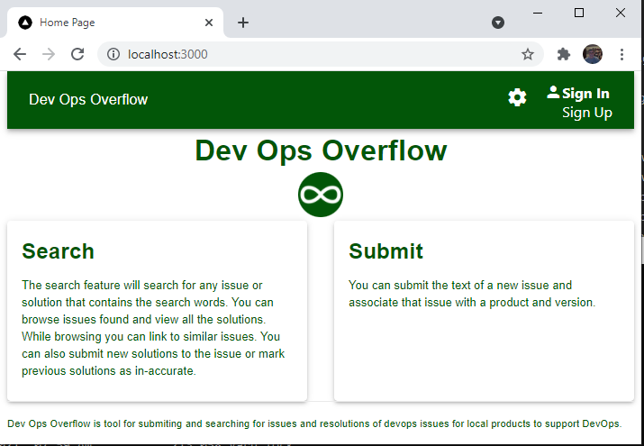

# devops_overflow
DEVOps Overflow is a server-less cloud based microservice for DEVOPS to track problems and solutions for local products.

The service can be run on AWS cloud as a lambda function with storage in Non-SQL repository
in the cloud. It does not require a SQL database so it has insignificat hosting costs.
It maintains a repository private to your installation. It allows a team to submit DEVOPS
issues associated with product. You can perform searches of previous submitted issues using
keywords found in the submitted issue. You can add multiple answers to issues similar to
Stack Overflow.

The home page is shown below running locally in a development environment.

# PreRequisites
The following are prerequisites to build devops_overflow
1. Install nodejs
2. Install Yarn (or NPM that comes with node).
3. Install golang

# Install
After cloning the repository to a local directory perform the following.
Change current directory to the src/ui directory.
1. yarn install
2. yarn run build

After building this will create a build with javascript files of the UI in the src/ui/out folder.

# Design
The tool is a microservice built with NextJS (a React library) and GOLANG for the server side. The design of the GO web services is using GinTonic for the web server with context
of a ServiceProvider class created as part of the microservice. The ServiceProvider provides
dependency injection of services which are written in the GO package internal/services.
The resources (controllers) of the web services ar in the GO package internal/resources.
The GinTonic routes are configured to the resources which use the context to to the services
that are configured in the main class main.go with configuration such as the AWS S3 bucket
containing the repository.
