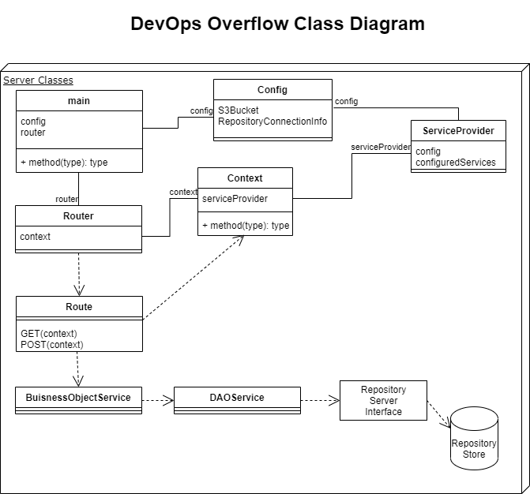

# DevOps Overflow
DevOps Overflow is a server-less cloud based microservice for DEVOPS to track problems and solutions for local products.

The service can be run on AWS cloud as a lambda function with storage in Non-SQL repository
in the cloud. It does not require a SQL database so it has insignificat hosting costs.
It maintains a repository private to your installation. It allows a team to submit DEVOPS
issues associated with product. You can perform searches of previous submitted issues using
keywords found in the submitted issue. You can add multiple answers to issues similar to
Stack Overflow.

The microservice is implemented in GO on server side and NextJS (react) on the UI side.

The home page is shown below running locally in a development environment.

# PreRequisites
The following are prerequisites to build devops_overflow
1. Install nodejs
2. Install Yarn (or NPM that comes with node).
3. Install golang (https://golang.org/doc/install)
4. AWS CLI Version 2 for AWS installation (https://aws.amazon.com/cli)

# Install
After cloning the repository to a local directory perform the following.
Change the current directory to the src/server directory and execute:

    go get .

Change current directory to the src/ui directory and execute:

    yarn install
    yarn run build
    yarn run export

After building and exporting this will create a directory with javascript files of the nextjs UI in the src/ui/out folder. The file src/ui/out/index.html is the top level file
of the user interface. 

# Running Locally
The UI can be run locally by from the src/ui folder by executing:

    yarn run dev
This uses nextjs to view the react source files locally without a web server.

The GO application server can be run locally from the src/server folder by executing:

    go run .
While running the server locally you can browse to https://localhost:8080

The web server will try to read and write to the S3 bucket configured in the config.yaml file.
Without an S3 bucket submitting and searching functions will not work. You can create the
S3 bucket by installing the application into the AWS cloud.

# Installing into the AWS Cloud
DevOps Overflow can be installed in the AWS cloud by executing this command from the src/ui folder.

    yarn run create_bucket

This will create an S3 bucket named devops-overflow-bucket using an AWS cloud formation template.
After the bucket is created when you run the server locally the bucket will be available to 
save and search content. Also, after the bucket is created you can also execute the command.

    yarn run install_cdn

This runs a different cloud formation template to create an Api Gateway and Lambda function for the REST services. It also copies the static HTML files to the S3 bucket and creates a Cloud Front CDN to expose the REST services and the static HTML under a single URL end point. After the install is complete use the AWS console to find the Cloud Front distribution object to get the URL of the end point.

# Design
The tool is a microservice built with NextJS (a React library) and GO for the server.
The design of the GO web services is using the Gin-Gonic library for the web server with context using a ServiceProvider class created as part of the microservice.

The ServiceProvider of the microservice provides dependency injection of services
which are written in the GO package api/internal/services.
The service provider is configured in the main class main.go with configuration such as the
S3 bucket name used in the environment. The configured service provider is added to
the Gin-Gonic context by the main class with middleware.

The resources (controllers) of the web services are in the GO package api/internal/resources.
The resources routes are registered in the class main.go.

The UI uses the react MUI library to support Google Material Design components.
This provides support for shadows, lighting, elevation and animation of
widgets.

